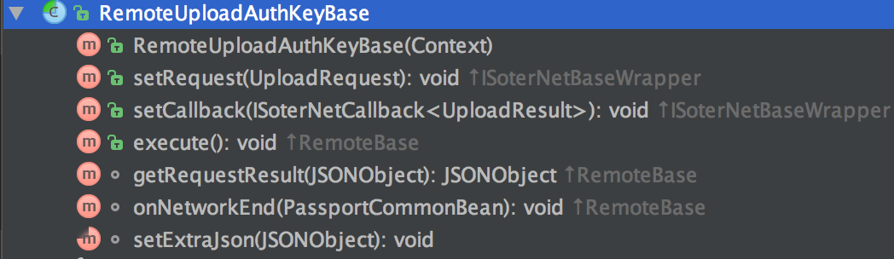

#我们离更方便只差一个指纹登录了
##指纹是一个并不陌生的新功能
	
		指纹识别这个概念对我们也许并不陌生，在ios设备上也很早就实现了指纹功能，甚至到现在已经支持了人脸识别。
	
		目前google提供的官方解决方案让android设备从6.0（API 23）开始正式支持指纹识别，同时对6.0以下设备进行了兼容。目前指纹领域无论从产品角度还是技术角度都已经趋于成熟，但是当各位开发者准备深入探究的时候，却发现网上的文章也都是皮毛，很难有较深的启示。
	
		文本将着重从58APP在接入指纹用于登录的整个过程，包括竞品分析、产品的设计方案逻辑、技术选型、代码的架构以及后续接入过程中遇到的问题等几个方面进行一一阐述。
	
		在这里抛砖引玉，希望能给予大家一些启发。
##指纹功能的用途
&ensp;&ensp;&ensp;&ensp;如果指纹识别大家不陌生的话，那么针对于指纹的使用场景我想大家也一定耳熟能详。它们是：
###1.屏幕解锁
&ensp;&ensp;&ensp;&ensp;解锁功能目前很多厂商都支持，比如小米，vivo，oppo等等，它们已经root到各自的系统中。这个衍生其实最早是从屏幕锁的派生，这样可以提高手机的安全性。

###2.支付
&ensp;&ensp;&ensp;&ensp;支付方面包括微信支付和支付宝支付，现在这个功能兼职方便的不要的，前几天不是有个法国小哥哥隔空@马化腾叔叔要求他们来法国开发一下：“我知道微信所有人都能下，但是里面的那些功能我们也想要”

###3.登录
&ensp;&ensp;&ensp;&ensp;登录几乎是目前市面上各个APP不可或缺的一个功能组成部分，尤其当下人们有着不同的APP，却都使用着一套的密码，为什么？因为APP太多太多了，所有的密码都不同的话人们很难记住。所以，用你独一无二的指纹做为密码用于登录，一方面非常安全，另外一方面可以省去你再记住密码的烦恼。

##指纹的分类
&ensp;&ensp;&ensp;&ensp;目前市面上比较流行的指纹大概有三种：google原生的fingerprintManager，阿里提供的阿里指纹2.0，微信提供的soter。这里可能大家会有困惑，既然google提供了原生的指纹识别，那么为什么，阿里和腾讯还要开发自己的指纹识别系统呢？

&ensp;&ensp;&ensp;&ensp;其原因有二：

&ensp;&ensp;&ensp;&ensp;首先google的“封装”比较好，能够暴露给外面的内容并不多，只有true和fales，这种情况就会有问题：比如你的手机锁屏密码被知道了，然后对方拿了你的手机偷偷录入一个指纹，结果就是这个应用可以使用手机里面的所有指纹进行验证；

&ensp;&ensp;&ensp;&ensp;其次，这个方案有一个比较严重的安全问题。

这里先给大家提供这三个版本的传送门：

Google原生API：[https://developer.android.com/reference/android/hardware/fingerprint/package-summary.html](https://developer.android.com/reference/android/hardware/fingerprint/package-summary.html)

阿里指纹2.0：[http://open.yunos.com/doc/detail?documentId=102937#](http://open.yunos.com/doc/detail?documentId=102937#)

微信soter：[https://github.com/Tencent/soter](https://github.com/Tencent/soter)

###1.Google原生API是怎么样的？
###·概述
android.hardware.fingerprint是google提供的指纹识别方案

FingerprintManager就是我们要使用的类，它包含其他三个内部类：AuthenticationCallback,AuthenticationResult,CryptoObject，它们分别代表的意思是：

|               | AuthenticationCallback| AuthenticationResult|  CryptoObject|
| ------------- | --------------------- |---------------------| -------------|
| 含义      | 指纹监听的回调，包括：失败，错误，成功这四个过程的监听| 认证结果 | 加密对象 |

原生的api实现起来非常简单：

	FingeprintManager mFingeprintManager = ...
	mFingeprintManager.authenticate(null, mCancellationSignal, 0 , new AuthenticationCallback(){...}, null);

根据上述的例子，再配合自己的应用场景，叮当，一切都变的那么简单。可是喔，为什么google提供的技术方案各大公司看完之后却纷纷摇头表示要自己另起炉灶呢？因为它着实不安全。
###2.为什么说它是不安全的呢？

不安全主要有两点：

1.指纹主要返回的就是true和false：

&ensp;&ensp;&ensp;&ensp;只要你的手机录入过指纹，那么就可以验证指纹通过。那么，假如手机的锁屏密码被知道了，被熊孩子不小心看到，然后他偷偷录入了自己的指纹。最后，他就可以通过这个指纹进行各种验证。换句话说，非常安全的生物指纹，直接降低到了锁屏密码的安全级别；

2.密钥对被劫持：

&ensp;&ensp;&ensp;&ensp;goolge允许用户在应用中生成一对非对称密钥，将私钥存储在TEE（关于TEE，下期文章会重点讲这货到底是咋回事，这里大家暂时做个了解）中。但是，如果在密钥生成的时候就被拦截并替换成了黑客自己的密钥，那么也会出现问题；

###3.第三方如何做到安全？

我们以微信soter为例做为分析：

|               | TENCENT SOTER         | Android Framework   |
| ------------- | --------------------- |---------------------| 
| 安全性     | 高（前后台支持，有产线生成一机一密根密钥）| 低（手机被root后易被破解，且无法准确检测root） |
| 接入成本	     | 较低（前端极轻量级sdk，后台无须集成sdk）	较低（前端极轻量级sdk，后台无须集成sdk）	| 低（无需前后台sdk）	 |
| 敏感业务可用|是（可获取本机指纹索引）| 否(无法获取指纹在本机索引，有盗用风险) |
| 用户隐私保护|好（不会获取指纹图案）|好（不会获取指纹图案） |
| 商业隐私保护|好（验证无须请求到中心服务）| \|

接下来我们看一下soter的实现原理吧：

简单的做些解释：
  
  （1）TAM中心是用于存储密钥的服务；
  
  （2）TEE是手机中的独立环境，目前没有有效的破解方法；
  
  （3）APP就是客户端；
  
  （4）后台应用便是后台服务器；
   
  （5）整个验证流程属于三层加密，分别是ATTK，ASK，AUTHKEY；它们分别都有私钥pri和公钥pub，加密时通常用上层私钥加密下层公钥生成密串，然后用下层私钥进行解密。 

通过上图，可以很轻松的得出：只要TEE区的ATTK私钥不被破解，那么破解微信soter几乎是不可能的。

###4.技术方案的选择
综合考虑了阿里和腾讯的技术方案之后，结合自己的技术选型，我们选择了腾讯的soter，主要原因有几个：

1.soter开放了源码：github上虽然star没有我想的多，不过毕竟人家开放了源码，出现问题可以及时排查，不至于手足无措；

2.soter开源差不多已经有半年时间，相信很多雷已经被热心的“小白鼠"们踩完；

3.它更适合于我们的技术体系（这个有点宽泛，其实我想说的你们都懂 = =）；

##58同城在登录SDK中接入soter
###从需求入手
了解需求之前有必要先一句话概括58的账号体系：

任何一个账号，无论是什么方式手机号动态码登录，微信，QQ，微博等第三方，它都唯一关联一个58账号，58账号与这些账号是一对多的绑定关系；

来，让我们接着谈需求，其实需求比较简单，主要有如下几个方面：

1.指纹登录；

&ensp;&ensp;&ensp;&ensp;即用户进入页面后，弹出指纹验证的提示框，使得用户可以进行指纹登录，进入后点击取消不再弹出入口。

&ensp;&ensp;&ensp;&ensp;对于登录首页是否设计明显入口其实这样做的好处比较明显，它会让页面更加整洁，进入页面后直接弹出来（当然是在用户已经录入过指纹的情况下），可以帮用户节省一步手动点击的操作；

&ensp;&ensp;&ensp;&ensp;但是这样做也有一定缺点的，因为用户点击了取消，就不能再在当前页面调起指纹登录，怎么再调起页面呢？只有开发和产品知道，这样多多少少会给用户造成困惑；

思考：如果是你应该如何解决这个问题？（别忘了文章前面说的：站在用户的角度去思考问题）

2.指纹验证 && 关闭指纹；
&ensp;&ensp;&ensp;&ensp;指纹的验证和关闭指纹各位可以理解成是58账号的一种新的登录方式，一种新的绑定关系，所以，这里的指纹验证和关闭指纹可以理解成绑定指纹和解绑指纹；

思考：一个手机是可以存储多个指纹的，而且一个账号不能绑定多个指纹。那么，这类的安全风险该如何控制？

3.很多你意想不到的细节

&ensp;&ensp;&ensp;&ensp;很多细节如果想不到，那么可能会遇到严重的问题。比如，切换账号的时候，指纹的信息是如何存储的？修改密码的时候是否需要把对应的指纹信息删除？

###顺便提一嘴登录SDK的框架
登录SDK是从58APP中剥离出来的，它的前身其实是58APP中的一个模块，再往前追溯它是hybrid框架中的一个基础组成部分，只不过一开始的时候耦合非常严重。

再封装成SDK后，它渐渐的意识到封印在自己体内的洪荒之力的强大。于是，它统一了58旗下大部分的APP的登录模块，它们分别是：

招财猫直聘；58同城；58车商通；抢单神器；58钱柜；58帮帮；

当然还有其他的内部的APP；

得益于前期对于登录SDK很好的设计，在接入指纹的时候，接入流程非常清晰，流程相对顺利，这里po一张登录SDK的框架设计图：

###吐槽大会开始--接入微信soter

#### 接入前的准备工作

1.仔细仔细仔细阅读github上wiki的所有文档，包括接入文档，了解原理（最基本的）；

2.熟读API文档，soter封装了google提供的方法；

3.仔细阅读soter的demo并梳理其使用场景（demo中的场景用于指纹支付）；

4.仔细阅读soter的SDK源码；

#### soter的demo解析

&ensp;&ensp;&ensp;&ensp;这里假设你已经做了一些接入前的准备工作（至少你已经了解了原理），那么我们来看一下它的demo，其实demo非常简单；

&ensp;&ensp;&ensp;&ensp;稍微有些不足的地方：比如，场景单一；哪些代码是不可变动的未进行解释说明；

&ensp;&ensp;&ensp;&ensp;接下来我们先在脑海里回想一下，从代码层面上来讲如果要做指纹支付（或者指纹登录）的完整流程是：

1）准备support接口：判断该设备是否支持soter；（对于soter能支持的设备列表，github上有链接）

	注意事项：看源码就会发现soter会自己封装一层，先判断本地是否支持，如果支持，再去server（微信）端查看，都支持，才会执行support接口；

2）准备Ask接口：该ask接口用于准备应用场景的密钥，该密钥生成一次即可。

	“第三方应用能且只能在TEE中生成唯一ASK（应用密钥），
	一旦ASK被成功生成，私钥被存储在TEE中”
	
3）准备authKey接口：该接口针对业务场景生成一个authkey，它有自己的失效时间，要根据不同的场景自己设计，比如当用户修改密码，关闭账号与指纹的绑定关系的时候，这个值需要删除并重新生成。

	对于每一个业务场景，你应该生成一对AuthKey（业务密钥）用于该场景指纹认证。
	AuthKey的生成过程与ASK类似——在TEE中生成，私钥在TEE中保存，公钥上传到服务器。
	不同的是，第三方应用应该自己检查AuthKey的合法性（实际上，我们真的不想知道你们的用户做了多少笔支付）。
	同时，生成AuthKey的时候，需要标记私钥只有在用户指纹授权之后才可以使用（正如Google在标准接口中定义的那样）。 
	
4）准备挑战因子：获取签名，用这个签名去验证你后面的业务逻辑；

	在认证之前，应用需要先向自己的服务器请求一个挑战因子（通常是一个随机串）作为用于签名的对象。
	用户指纹授权之后，你将可以导出一个JSON结果，其中包含了你刚刚请求的挑战因子、用户使用了哪个手指（fid）以及其他设备信息，和这个JSON结果对应AuthKey的签名。
	之后，将他们发送到自己的服务器，自己使用之前存储的AuthKey公钥验签就好。
	其中，fid也是在TEE中自动读取并连同结果一起被签名的，也就是说，黑客是无法伪造。

5）准备业务逻辑：无论你是那种场景（登录或者支付），执行了上面的操作之后，就可以执行具体的场景了；

OK，再来回顾一下：一个完整的微信soter的认证，需要执行的步骤是：

准备support -> 准备ASK -> 准备AuthKey -> 准备挑战因子  -> 执行具体的业务逻辑

demo的源码如下图，我列出每个类的作用，里面的逻辑很简单；

#### 理想的接入姿势

&ensp;&ensp;&ensp;&ensp;如果各位不想看源码，理解了demo的意思其实就可以完成接入；还记得上一节的整个soter的验证流程么？我们具体来看一下具体的代码实现：

1）准备support接口：这个入口要在程序初始化的时候（application中）预先判断是否支持；注意ASK不要在这里初始化，因为ASK的生成过程会明显造成APP卡顿，只要在具体用的时候生成就好；

&ensp;&ensp;&ensp;&ensp;调用support之后，最好在正式使用其他接口之前，先调用下soter提供的是否录入过指纹，如果没有录入，要先跳转到设置里面进行指纹的录入；

	@Override
    public void onCreate() {
        super.onCreate();
        initSoterSupport();
    }
    
    private void initSoterSupport() {
        InitializeParam param = new InitializeParam.InitializeParamBuilder().setGetSupportNetWrapper(new RemoteGetSupportSoter()).setScenes(ConstantsSoterDemo.SCENE_LOGIN)
                .build();
        SoterWrapperApi.init(getApplicationContext(), mGetIsSupportCallback, param);
    }
    
    //判断指纹是否录入过	FingerprintManagerCompat.from(context.getApplicationContext()).hasEnrolledFingerprints()
    
2）准备ASK接口：这个接口在启动的时候会有明显能感知到的卡顿，询问过soter的开发同学，他们也表示这个问题确实会有；所以为了可以减少卡顿，这个接口通常在程序调用一次之后就不需要再调用了，有一个参数是可以控制的：isAutoDeleteIfAlreadyExists；

&ensp;&ensp;&ensp;&ensp;实际上我在写代码的时候，是没有使用这个方法的，因为调用它之后一定会调用authkey，调用authkey的时候也会有参数用于控制是否生成ask；

	    public static void prepareAppSecureKey(SoterProcessCallback<SoterProcessKeyPreparationResult> callback, boolean isAutoDeleteIfAlreadyExists, IWrapUploadKeyNet appSecureKeyNetWrapper) {
        SLogger.i("Soter.SoterWrapperApi", "soter: starting prepare ask key. ", new Object[0]);
        TaskPrepareAppSecureKey taskPrepareAppSecureKey = new TaskPrepareAppSecureKey(appSecureKeyNetWrapper, isAutoDeleteIfAlreadyExists);
        taskPrepareAppSecureKey.setTaskCallback(callback);
        if(!SoterTaskManager.getInstance().addToTask(taskPrepareAppSecureKey, new SoterProcessKeyPreparationResult())) {
            SLogger.d("Soter.SoterWrapperApi", "soter: add prepareAppSecureKey task failed.", new Object[0]);
        }
    }

3）准备authkey接口：这里第一步support接口一定要执行完，第二步是必须但是不定要直接调用；因为这个步骤也会帮助你准备ask，有一个参数是这样的：isAutoPrepareASKWhenNotFound，顾名思义，如果没有找到就自动准备；

	//soter源码
	public static void prepareAuthKey(SoterProcessCallback<SoterProcessKeyPreparationResult> callback, boolean isAutoDeleteIfAlreadyExists, boolean isAutoPrepareASKWhenNotFound, int scene, IWrapUploadKeyNet authKeyNetWrapper, IWrapUploadKeyNet appSecureKeyNetWrapper) {
        SLogger.i("Soter.SoterWrapperApi", "soter: starting prepare auth key: %d", new Object[]{Integer.valueOf(scene)});
        TaskPrepareAuthKey taskPrepareAuthKey = new TaskPrepareAuthKey(scene, authKeyNetWrapper, appSecureKeyNetWrapper, isAutoDeleteIfAlreadyExists, isAutoPrepareASKWhenNotFound);
        taskPrepareAuthKey.setTaskCallback(callback);
        if(!SoterTaskManager.getInstance().addToTask(taskPrepareAuthKey, new SoterProcessKeyPreparationResult())) {
            SLogger.d("Soter.SoterWrapperApi", "soter: add prepareAuthKey task failed.", new Object[0]);
        }

    }
	//示例
	SoterWrapperApi.prepareAuthKey(new SoterProcessCallback<SoterProcessKeyPreparationResult>() {
            @Override
            public void onResult(@NonNull SoterProcessKeyPreparationResult result) {
                if (callback != null) {
                        callback.onResult(result.errCode == SoterProcessErrCode.ERR_OK, result.errCode, result.getErrMsg());
            }
        }, false, true, WubaSetting.SCENE_LOGIN, new RemoteUploadLoginAuthkey(mContext, VERIFY_TYPE), new RemoteUploadASK(mContext));

4）准备挑战因子：挑战因子的作用这里不再赘述，我想说的是，如果已经上传过挑战因子，要把它记录下来，然后以后，你就可以直接用，这样就又少了一次挑战因子的请求；

有几个需要注意的问题：
（1）setScene：是想要设置的指纹验证方式，很多地方都会用到，最好自定义一个常量；
（2）setFingerprintCanceller：这个方法非常关键，因为你不知道用户是怎么样的行为，当用户在验证过程中的任何时候取消，那么都需要这个方法取消掉当前的验证过程，否则也会报错；
（3）setIWrapGetChallengeStr && setPrefilledChallenge 这两个方法

	AuthenticationParam param = new AuthenticationParam.AuthenticationParamBuilder() 
                .setScene(WubaSetting.SCENE_LOGIN) 
                .setContext(mContext) 
                .setFingerprintCanceller(mCanceller) 
                .setIWrapGetChallengeStr(new RemoteGetChallengeStr(mContext)) 
                .setPrefilledChallenge(getFingerByUserID()) 
                .setIWrapUploadSignature(uploadSignatureWrapper) 
                .setSoterFingerprintStateCallback(mSoterFingerprintStateCallback).build();
        SoterWrapperApi.requestAuthorizeAndSign(processCallback, param);

5）准备自己的业务逻辑：敲黑板，这个地方很重要。这里会着重讲一下微信soter的设计精彩地方，可以让我们很方便的即进行了业务请求又能保证密钥的实时更新；

&ensp;&ensp;&ensp;&ensp;我们先来看一下demo中的bRemoteBase类，它是所有网络请求的核心类，具体的网络请求要自己实现，参数你要自己封装带给后台；

它的三个方法比较关键：
（1）execute()：这个方法代表执行网络请求，调用这个方法之前所有的参数务必需要准备好
（2）onNetworkEnd()：这个方法代表执行网络请求之后的回调，这个回调你可以定义自己的结果，因为子类会用到，下面马上讲；
 (3) getNetUrl()：子类重写这个方法，代表执行请求的url是什么；
 
我们再找一个它的子类；

它的两个方法非常关键：
（1）setRequest():通过这个方法你可以把对应的密钥参数透传给server，为什么是透传呢？

注意：这里我们可以通过其他方式获取签名，但是没有意义，也千万不要这么做，一定要按照下面的方式传给server；

	@Override
    public void setRequest(@NonNull UploadRequest requestDataModel) {
        JSONObject requestJson = new JSONObject();
        try {
            requestJson.put(KEY_SIGN, requestDataModel.mKeyJsonSignature);
            requestJson.put(KEY_UPLOAD_AUTHKEY, requestDataModel.mKeyJson);
        } catch (JSONException e) {
            e.printStackTrace();
        }
    }
    
（2）onNetworkEnd()：这个方法是请求结束后，会将结果回调到这里，然后我们再通过前面的接口回调给最外面验证的回调里面，回调调用方式如下：

	 @Override
    void onNetworkEnd(PassportCommonBean passportCommonBean) {
        if(mCallback != null) {
            mCallback.onNetEnd(new UploadResult(passportCommonBean != null && passportCommonBean.getCode() == 0));
        }
    }
    
怎么样？整个流程经过这几步骤，一个完整的验证过程就算是走完了，看完之后有没有感觉到轻松些？

其实我也没有把整个的代码全拿过来，我是把所有的点都打散到每个章节中了。说到这，估计各位都是可以顺利接入的。

#### 接下来我再说说在接入过程中遇到的坑：

#### 1.soter的请求结果与回调

&ensp;&ensp;&ensp;&ensp;通过自己的业务请求，想必大家已经领略了soter通过NetWrapper封装网络请求带来的好处，但是，它同样也会带来问题，那就是后续的个性化请求的问题；

&ensp;&ensp;&ensp;&ensp;我们知道网络请求最终请求入口在remotebase中，执行了指纹登录的请求之后，在onnetworkend进行回调。这个回调里面最终返回到SoterProcessCallback<SoterProcessAuthenticationResult>的onResult中的时候，那些额外的参数都被“消化”了；

	public class SoterProcessAuthenticationResult extends SoterProcessResultBase<SoterSignatureResult> {
    public SoterProcessAuthenticationResult() {
    }

    public SoterProcessAuthenticationResult(int errCode, String errMsg) {
        super(errCode, errMsg);
    }

    public SoterProcessAuthenticationResult(int errCode, String errMsg, SoterSignatureResult extData) {
        super(errCode, errMsg, extData);
    }

    public SoterProcessAuthenticationResult(int errCode) {
        super(errCode);
    }

    public SoterProcessAuthenticationResult(int errCode, SoterSignatureResult extData) {
        super(errCode, extData);
    }
}

&ensp;&ensp;&ensp;&ensp;那么假如我想在执行指纹登录的网络请求之后，让SoterProcessAuthenticationResult给我回调一些额外的登录信息，比如userid，应该怎么办呢？

&ensp;&ensp;&ensp;&ensp;解决办法：目前只能在封装登录的soter里面，先把userid存起来。然后在回调里面，获取对应的soter对象，然后再拿到里面的userid。

#### 2.设备是否支持指纹 & 设备是否支持soter & 设备是否录入过指纹

这几个状态在接入之前一定要非常清楚；

设备支持指纹，不代表它支持soter，支持了soter，不代表用户录入过指纹；

只有当上述三个状态都满足的情况下，才可以进行后续的验证工作，否则，会带来不必要的麻烦。

所以一开始QA同学经常会跑来问我，为啥这个手机支持指纹，却无法进行指纹验证捏？于是，我就手动弹了toast，先判断一下设备是否支持soter，如果不支持就可以换个设备测试了。

#### 3.token要做缓存处理

这个接口的调用次数有限制，它的时限是两个小时。所以，各位接入的小伙伴一定要做好对于token的缓存，否则分分钟超出限制，会导致线上用户不能再使用指纹；

https://api.weixin.qq.com/cgi-bin/token?grant_type=client_credential

#### 4.文档的重要性

&ensp;&ensp;&ensp;&ensp;做为登录SDK的提供方，最不愿意做的就是重复劳动。所以在提供SDK初期就深知接入文档与记录的重要性，接入文档不是原理文档，不是代码的API文档，更不是一个不会迭代的文档；

&ensp;&ensp;&ensp;&ensp;写接入文档的时候就应站在接入方的角度思考问题，时刻要想着：“假如你就是接入方，那么你希望看到什么样的文档？”；可以换位思考，尽量做到假如接入方什么代码都不看，只用这个文档，也可以进行接入。所以，它大致应该包括如下几个部分：概述，集成方式，集成规范以及注意事项，不同场景下的最简单的可以运行的demo（非伪代码），常见问题与反馈。而且，该文档应该定期更新。

举个栗子，这是登录SDK对外提供的接入文档：

	1版本号说明
	2PASSPORT SDK 说明文档 Android版 
	3概述 
	4SDK集成
	5SDK接入规范
		5.1初始化服务
		5.2版本号说明
		5.3三方登录配置
			5.3.1QQ授权
			5.3.2微信授权
		5.4接口调用
		5.5注意事项 
		5.6关于埋点（记录用户行为日志）
	6SDK接口使用
		6.1调起页面类接口
			6.1.1调起登录页面
			6.1.2调起微信注册页面
			......
			6.1.8调起修改密码
		6.2获取状态类
			6.2.1手机号是否可以解绑 
			6.2.2校验PPU  
			......
			6.2.14获取手机绑定状态 
		6.3无页面调起类
			6.3.1无页面注册与取消注册：
				6.3.1.1注册
				6.3.1.2取消注册
			......
			6.3.7第三方绑定
				6.3.7.1绑定微信
				6.3.7.2绑定QQ
		6.4设置操作类
			6.4.1退出登录 
		6.5 常见问题解答
			6.5.1登录成功了，但是没收到回调？
			6.5.2登录成功后，回到应用桌面，体验上类似闪退
			6.5.3启动登录页面后点击Home键会得到桌面，再次点击app图标打开的页面不是刚才的登陆页面？
			6.5.4遇到so包解析失败问题，截图如下：
			6.5.5qq登录时返回错误文案：
			6.5.6上述问题都不是

### 写在最后

&ensp;&ensp;&ensp;&ensp;我能理解soter的初衷，其实现在的我们都是被惯坏了，soter既然已经开源，就证明它除了关键技术外，已经一览无遗的暴露给我们了。当出现问题的时候，通过代码直接打断点进去看结果，比任何人解释都有说服力，你看与不看，代码就在那里。

&ensp;&ensp;&ensp;&ensp;但反过来说，不可能所有的同学都有足够的时间去阅读源码。开发同学在整个“生态环境”中还是处于“食物链”的最低端的，需求有时候来了挡都挡不住，产品要求一周上线。那么短短的三五天时间又要理解源码，又要保证完美上线其实是很难的。

&ensp;&ensp;&ensp;&ensp;我在的团队非常和谐，大家都非常nice。所以我才有功夫写此拙文，写的不好大家莫怪。

&ensp;&ensp;&ensp;&ensp;所以如果你也想有一个这样的团队，快来加入我们吧~~~

### 参考文章

1.https://juejin.im/entry/59ccebdcf265da06611f929b

2.https://mp.weixin.qq.com/s?__biz=MjM5NjM4MDAxMg==&amp;mid=2655074243&amp;idx=1&amp;sn=7e19bae2927137ac03f533b6522f6c9a&amp;scene=21#wechat_redirect

3.https://github.com/Tencent/soter

